# TestFramework.Core — arc42 Architecture Documentation

> **Version:** 1.1
> **Date:** April 2026
> **Audience:** Team members who use, extend, or maintain the framework

---

## Table of Contents

1. [Introduction and Goals](#1-introduction-and-goals)
2. [Constraints](#2-constraints)
3. [System Scope and Context](#3-system-scope-and-context)
4. [Solution Strategy](#4-solution-strategy)
5. [Building Block View](#5-building-block-view)
6. [Runtime View](#6-runtime-view)
7. [Deployment View](#7-deployment-view)
8. [Cross-Cutting Concepts](#8-cross-cutting-concepts)
9. [Architecture Decisions](#9-architecture-decisions)
10. [Quality Requirements](#10-quality-requirements)
11. [Risks and Technical Debt](#11-risks-and-technical-debt)
12. [Glossary](#12-glossary)
13. [Quickstart](#13-quickstart)

---

## 1. Introduction and Goals

### 1.1 Purpose

**TestFramework.Core** is the technology-agnostic engine of an integration testing framework. It defines a **Timeline-based DSL** (Domain-Specific Language) for declaratively describing, executing, and evaluating integration test workflows.

**Core responsibility:** Provide a reproducible, structured test run that:

- Executes steps sequentially with configurable retry and timeout logic
- Transports typed values between steps via a variable store
- Automatically sets up and tears down artifacts (files, DB records, blobs…)
- Produces an immutable result after execution, ready for assertion

### 1.2 Quality Goals

| Priority | Goal | Description |
|----------|------|-------------|
| 1 | **Type safety** | Compile-time validation of variables, artifacts, and step results via generics (CRTP pattern) |
| 2 | **Immutability** | After build/run all structures are frozen — no accidental mutations |
| 3 | **Extensibility** | New services (Azure, local I/O, …) attach as extension projects without touching Core |
| 4 | **Readability** | Fluent builder API makes test plans understandable even for non-developers |
| 5 | **Traceability** | Full logging of every step, retry, timing, and result via `ITestOutputHelper` |

### 1.3 Stakeholders

| Role | Expectation |
|------|-------------|
| Test developer | Simple API for defining new integration tests |
| Framework developer | Clear extension points for new triggers / artifacts |
| CI/CD pipeline | Deterministic cleanup, structured test results |

---

## 2. Constraints

### 2.1 Technical

| Constraint | Detail |
|------------|--------|
| Runtime | .NET 8.0 |
| Test framework | xUnit (via `xunit.abstractions` for `ITestOutputHelper`) |
| Serialisation | Newtonsoft.Json (debug state output) |
| Build system | MSBuild with `WriteLinesToFile` task for `BuildInfo.g.cs` |

### 2.2 Organisational

| Constraint | Detail |
|------------|--------|
| Extension projects | `TestFramework.Azure`, `TestFramework.LocalIO`, `TestFrameworkArtifactTracker` depend on Core |
| Configuration | Provided by `TestFramework.Config.ConfigInstance` — not part of Core itself |

---

## 3. System Scope and Context

### 3.1 Business Context

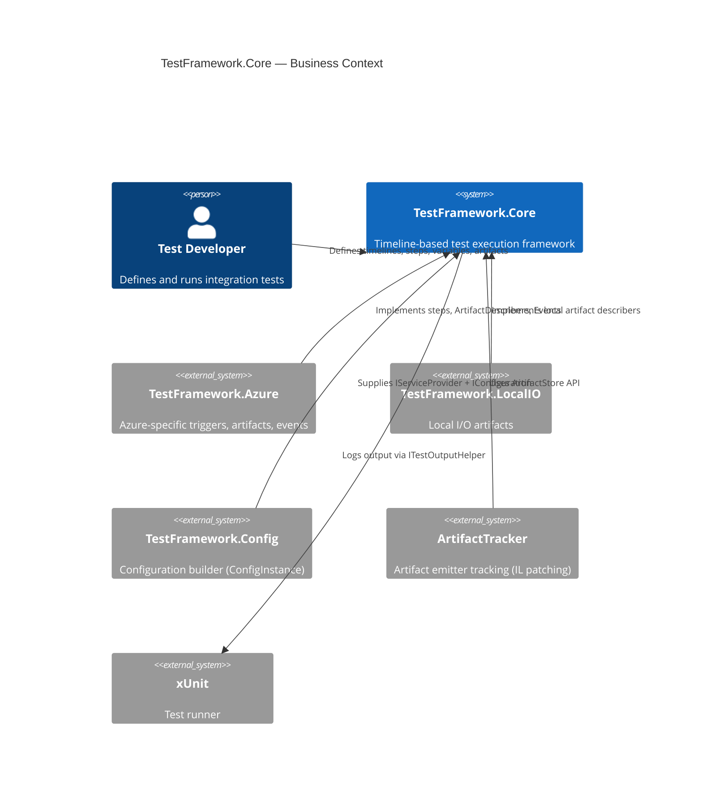

### 3.2 Technical Context

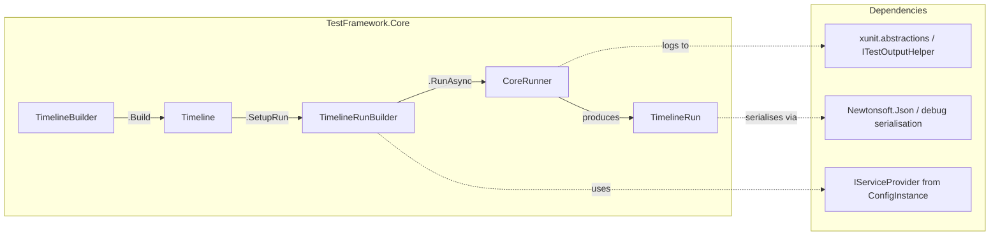

---

## 4. Solution Strategy

| Decision | Rationale |
|----------|-----------|
| **Three-phase architecture** (Build → Run → Result) | Clear separation between test plan definition, execution, and evaluation |
| **Freezable pattern** instead of `readonly` | Collections and nested objects must be immutable after build/run but mutable during building |
| **CRTP** for artifacts | Enforces at compile time that Reference, Data, and Describer belong together |
| **Emitter-based preprocessor** | Conditional steps and loops are resolved to concrete steps only at runtime |
| **`VariableReference<T>`** (Const vs. Resolvable) | Step config (timeout, retry count) can be either static or dynamically resolved |
| **Untyped + typed parallel hierarchies** | Typed APIs for developers; untyped bases for internal collections and runtime dispatch |

---

## 5. Building Block View

### 5.1 Level 1 — Overview

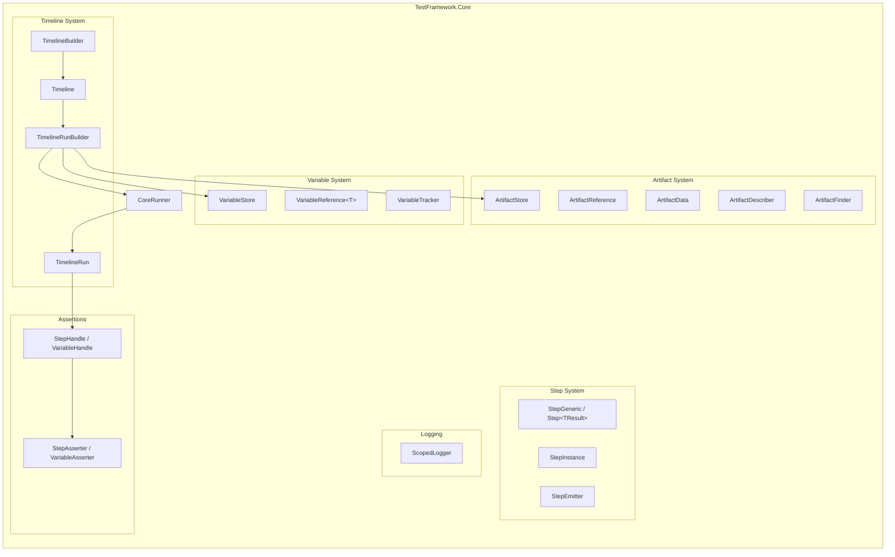

### 5.2 Level 2 — Timeline System

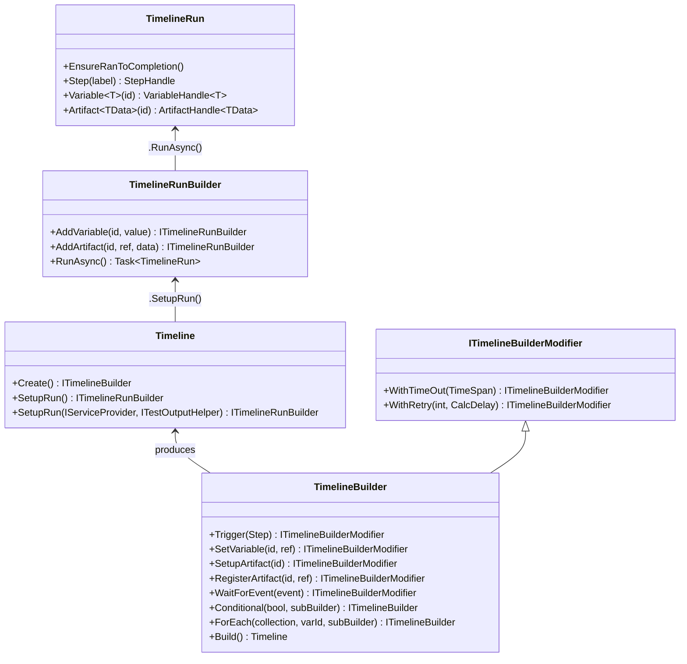

### 5.3 Level 2 — Step Hierarchy

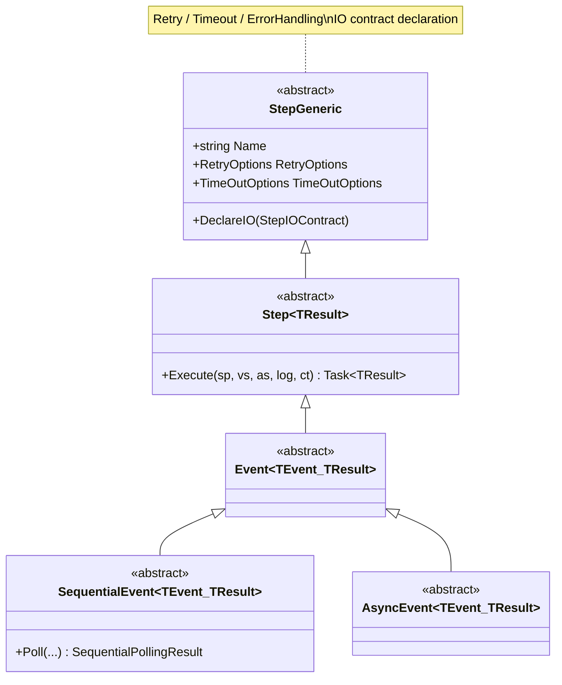

### 5.4 Level 2 — Artifact Triple Constraint (CRTP)

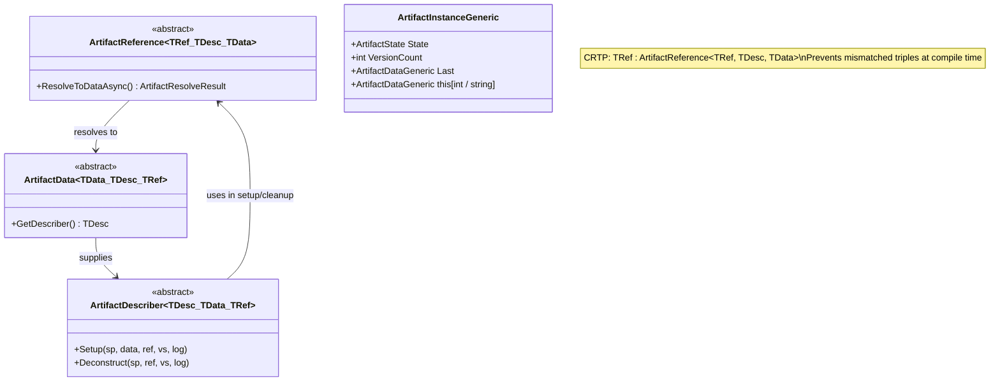

### 5.5 Level 2 — Variable System

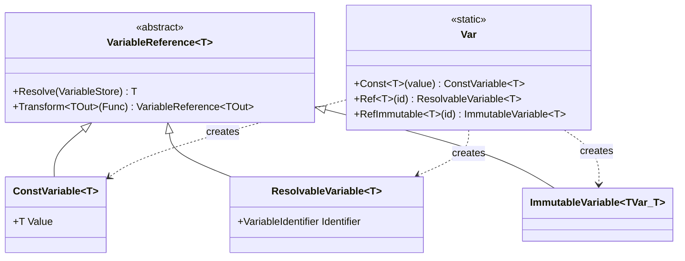

### 5.6 Level 2 — StepEmitter Preprocessor

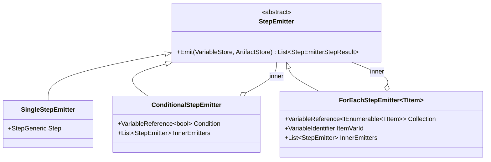

---

## 6. Runtime View

### 6.1 Scenario: Full Test Run

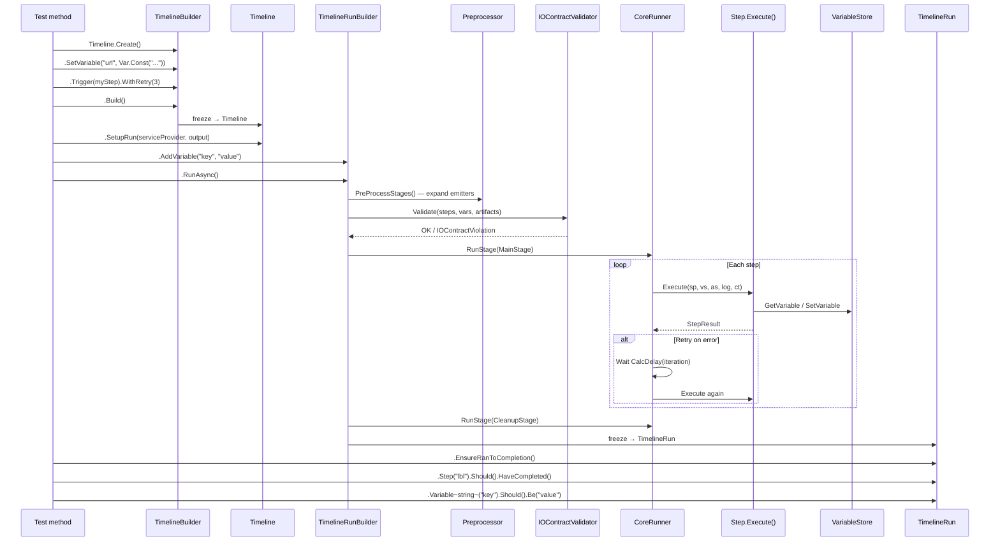

### 6.2 Scenario: Retry with Timeout

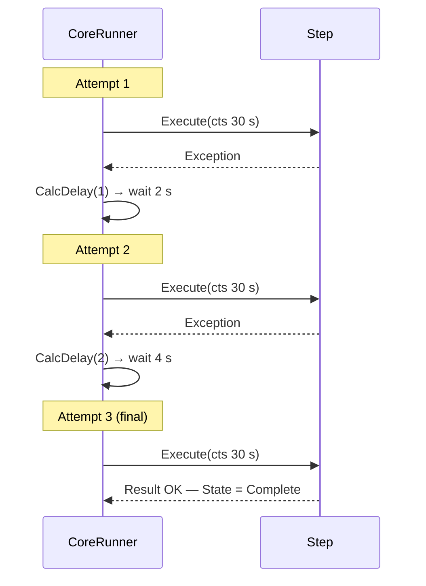

### 6.3 Scenario: Conditional & ForEach Preprocessing

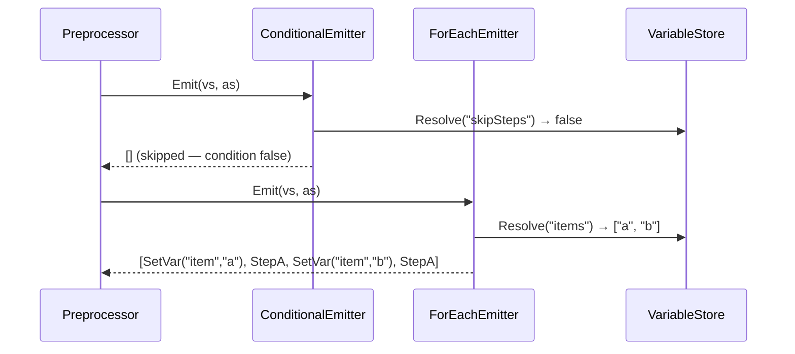

---

## 7. Deployment View

TestFramework.Core is a **pure class library** with no deployment unit of its own.

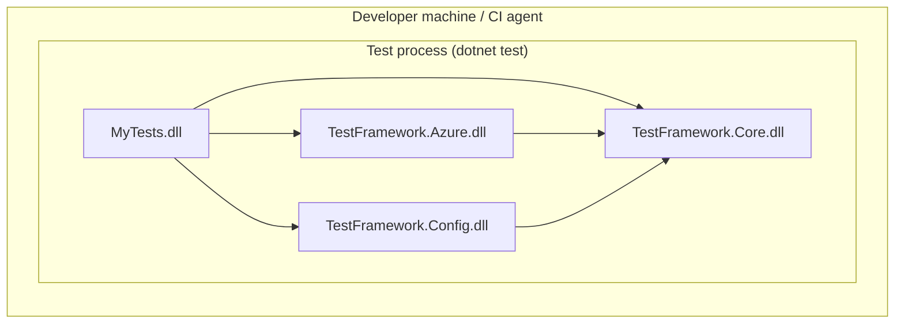

---

## 8. Cross-Cutting Concepts

### 8.1 Freezable Immutability Pattern

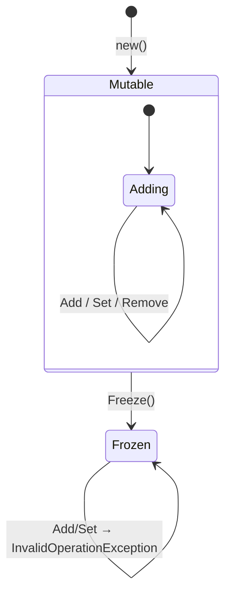

**Affected types:** `FreezableCollection<T>`, `FreezableDictionary<K,V>`, `Timeline`, `TimelineRun`, `StageInstance`, `StepInstanceGeneric`, `CommonHttpRequest`

After `.Build()` or `.RunAsync()`, no structural changes are allowed.

### 8.2 IO Contract Validation

Each step declares inputs and outputs via `DeclareIO(StepIOContract)`:

```csharp
public override void DeclareIO(StepIOContract contract)
{
    contract.Inputs.Add(new("orderId", StepIOKind.Variable, Required: true, typeof(string)));
    contract.Outputs.Add(new("result", StepIOKind.Variable, Required: false, typeof(int)));
}
```

`IOContractValidator` checks **before execution**: all required inputs are defined, types match, and there are no forward references.

### 8.3 Logging Architecture

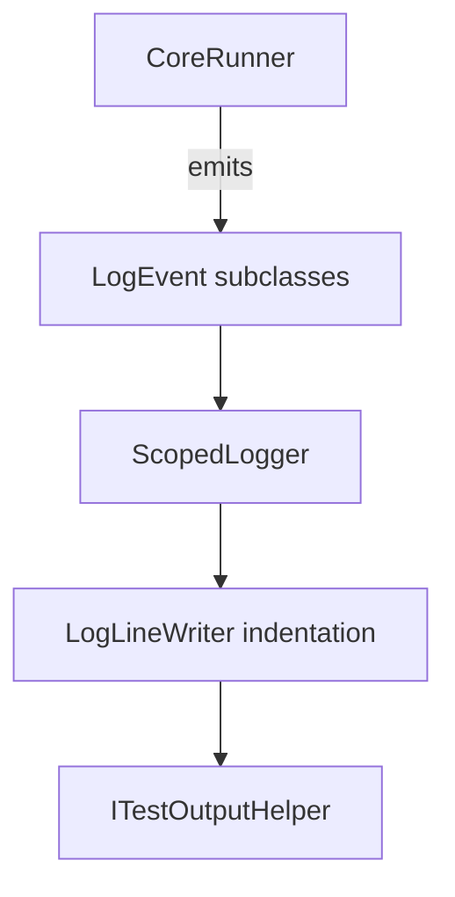

Every stage/step entry increases the indent level. Step outcome, timing, and retry details are logged automatically.

### 8.4 Assertion System

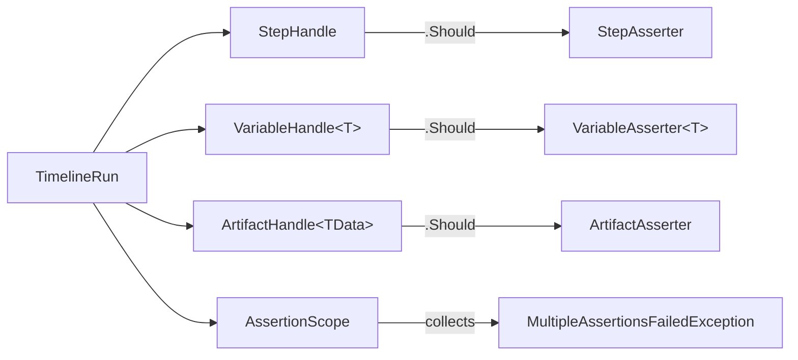

```csharp
run.Step("upload").Should().HaveCompleted().And().NotHaveThrown();
run.Variable<int>("count").Should().Exist().And().BeGreaterThan(0);
run.Artifact<BlobData>("file").Should().HaveBeenSetUp();
```

### 8.5 Exception Hierarchy

| Exception | Thrown when |
|-----------|-------------|
| `VariableDoesNotExistException` | Variable accessed but never defined |
| `VariableDoesNotYetExistException` | Variable read before its definition step ran |
| `CannotSetImmutableVariableException` | Attempt to mutate an immutable variable |
| `VariableNeedsToBeImmutableException` | Step requires immutable but received mutable |
| `ArtifactDoesNotExistException` | Artifact accessed but never registered |
| `ArtifactDoesNotYetExistException` | Artifact read before its setup step ran |
| `ValueAssertionException` | `.Should()` assertion value mismatch |
| `AssertVariableException` | `AssertVariable` step predicate failed |
| `StepAssertionException` | Post-run step state assertion failed |
| `MultipleAssertionsFailedException` | All failures collected in an `AssertionScope` |
| `TimelineRunFailedException` | Run completed with one or more failed steps |
| `IOContractViolationException` | Required input missing at pre-execution validation |
| `IOContractTypeViolationException` | Input/output type mismatch |

---

## 9. Architecture Decisions

### ADR-1: CRTP for Artifact Type Safety

**Context:** Artifacts consist of three related types (Reference, Data, Describer). Mixing them must be caught at compile time.

**Decision:** CRTP with circular generic constraints:

```csharp
class ArtifactData<TData, TDescriber, TReference>
    where TData      : ArtifactData<TData, TDescriber, TReference>
    where TDescriber : ArtifactDescriber<TDescriber, TData, TReference>, new()
    where TReference : ArtifactReference<TReference, TDescriber, TData>
```

**Consequence:** High type safety at the cost of complex signatures. Extension projects encapsulate this.

### ADR-2: Emitters Instead of Direct Step Storage

**Context:** The builder must support conditionals and loops without complicating the API.

**Decision:** The builder stores `StepEmitter` objects resolved to concrete steps at runtime.

**Consequence:** `Conditional` and `ForEach` share the same mechanism. Steps can depend on runtime values.

### ADR-3: Three-Phase Separation (Build → Run → Result)

**Decision:** `Timeline` (immutable blueprint) → `TimelineRunBuilder` (config + execution) → `TimelineRun` (immutable result).

**Consequence:** A single `Timeline` can be executed multiple times with different input parameters.

### ADR-4: VariableReference Instead of Direct Values

**Decision:** All configuration values are `VariableReference<T>`, resolved via `VariableStore`.

**Consequence:** Static via `Var.Const(…)`, dynamic via `Var.Ref<T>("name")`. Same step, different contexts.

---

## 10. Quality Requirements

### 10.1 Quality Tree

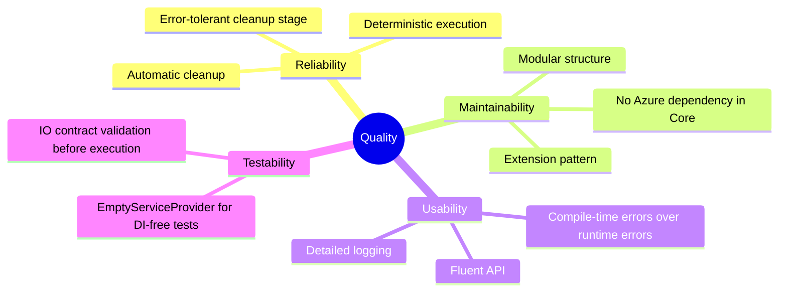

### 10.2 Quality Scenarios

| Scenario | Goal | Expected behaviour |
|----------|------|--------------------|
| Step throws exception | Reliability | Retry after configured delay; after max retries → Error state, next step continues |
| Artifact setup fails | Reliability | Cleanup stage still attempts teardown of all artifacts; errors are logged |
| Type mismatch in artifact | Usability | Compiler error via CRTP or `IOContractTypeViolationException` before execution |
| New Azure service needed | Maintainability | Only the extension project changes; Core is untouched |
| Test fails | Traceability | Full log of all steps, retries, timing, and errors via `ITestOutputHelper` |

---

## 11. Risks and Technical Debt

| # | Risk / Debt | Impact | Mitigation |
|---|------------|--------|-----------|
| 1 | **Missing XML documentation** on public API | Reduced discoverability | Add XML docs incrementally |
| 2 | **Variable immutability only enforced at runtime** | Faulty tests compile but fail at run | `VariableTracker.EnsureValidity()` is called automatically; consider a Roslyn analyser |
| 3 | **`CalcDelay` iteration starts at 1** | Confusion when writing custom delegates | Use `CalcDelays.Exponential/Fixed/Linear/None` predefined helpers |
| 4 | **ForEach auto-naming may collide** | Implicit names like `"artifact_1"` clash with user names | Document convention or enforce a prefix |
| 5 | **Artifact resolution `Found=false` is silent** | Subsequent steps operate on a `NotFound` artifact | Consider a `FailIfNotFound` option |

---

## 12. Glossary

| Term | Definition |
|------|-----------|
| **Timeline** | Immutable blueprint of a test workflow |
| **Stage** | Logical grouping of steps (Main stage, Cleanup stage) |
| **Step** | Single executable action. Base: `Step<TResult>` |
| **StepEmitter** | Deferred step generator resolved at runtime (`Conditional`, `ForEach`) |
| **Variable** | Named typed value transported via `VariableStore` |
| **VariableReference\<T\>** | `ConstVariable<T>` (static) or `ResolvableVariable<T>` (runtime lookup) |
| **Artifact** | Managed data object with setup/cleanup lifecycle |
| **ArtifactDescriber** | Defines setup and deconstruct logic |
| **ArtifactReference** | Identifies a concrete artifact and resolves it to data |
| **ArtifactData** | Payload snapshot at a specific point in time |
| **Freezable** | Object becomes immutable after `.Freeze()` |
| **CRTP** | Curiously Recurring Template Pattern — self-referencing generics |
| **IO Contract** | Step input/output declaration for pre-execution validation |
| **Event** | Step that waits for an external event |
| **CoreRunner** | Execution engine with retry/timeout logic |
| **CalcDelay** | `TimeSpan(int iteration)` delegate. **Iteration starts at 1.** |
| **CalcDelays** | Static helpers: `Exponential`, `Fixed(t)`, `Linear(t)`, `None` |
| **EmptyServiceProvider** | No-op `IServiceProvider`; writes a `Debug` warning when a service is requested |
| **ConfigInstance** | Builder in `TestFramework.Config` for constructing `IServiceProvider` + `IConfiguration` |

---

## 13. Quickstart

### 13.1 Add References

```xml
<!-- Minimal — Core only -->
<PackageReference Include="TestFramework.Core" Version="0.1.0" />

<!-- Add when you need DI/config composition for runs -->
<PackageReference Include="TestFramework.Config" Version="0.1.0" />

<!-- Add for lightweight helper triggers -->
<PackageReference Include="TestFramework.Simple" Version="0.1.0" />
```

### 13.2 First Test

```csharp
using TestFramework.Core.Timelines;
using TestFramework.Core.Variables;
using TestFramework.Core.Steps.Options;
using Xunit;
using Xunit.Abstractions;

public class MyFirstTest(ITestOutputHelper output)
{
    [Fact]
    public async Task Simple_Timeline_Test()
    {
        // 1. BUILD — define the test plan
        var timeline = Timeline.Create()
            .SetVariable("greeting", Var.Const("Hello World"))
            .Trigger(new MyCustomStep())
                .WithTimeOut(TimeSpan.FromSeconds(30))
                .WithRetry(2, CalcDelays.Exponential)
            .Build();

        // 2. RUN — configure inputs and execute
        var run = await timeline
            .SetupRun(output)          // pass output helper; no DI needed for pure steps
            .AddVariable("extraParam", 42)
            .RunAsync();

        // 3. ASSERT — evaluate the frozen result
        run.EnsureRanToCompletion();
        run.Variable<string>("greeting").Should().Exist().And().Be("Hello World");
    }
}
```

### 13.3 Writing a Custom Step

```csharp
using TestFramework.Core.Steps;
using TestFramework.Core.Steps.Options;

public class MyCustomStep : Step<string>
{
    public override string Name => "My Custom Step";

    public override void DeclareIO(StepIOContract contract)
    {
        contract.Inputs.Add(new("greeting", StepIOKind.Variable, Required: true, typeof(string)));
        contract.Outputs.Add(new("result",  StepIOKind.Variable, Required: false, typeof(string)));
    }

    public override async Task<string?> Execute(
        IServiceProvider serviceProvider,
        VariableStore variableStore,
        ArtifactStore artifactStore,
        ScopedLogger logger,
        CancellationToken cancellationToken)
    {
        var greeting = variableStore.GetVariable<string>("greeting");
        logger.LogInformation($"Greeting: {greeting}");
        variableStore.SetVariable("result", $"Processed: {greeting}");
        return greeting;
    }
}
```

### 13.4 Using Artifacts

```csharp
var timeline = Timeline.Create()
    .SetupArtifact("myBlob")             // setup (upload)
    .Trigger(new ProcessingStep())
    .CaptureArtifactVersion("myBlob")    // snapshot state after processing
    .Build();

var run = await timeline
    .SetupRun(serviceProvider, _output)
    .AddArtifact("myBlob", myRef, myData)
    .RunAsync();

run.EnsureRanToCompletion();
run.Artifact<MyData>("myBlob").Should().HaveBeenSetUp();
// Artifact is automatically deleted in the cleanup stage
```

### 13.5 Retry Delay Strategies

```csharp
// Predefined helpers
.WithRetry(3, CalcDelays.Exponential)                       // 2 s, 4 s, 8 s (default)
.WithRetry(3, CalcDelays.Fixed(TimeSpan.FromSeconds(5)))    // 5 s, 5 s, 5 s
.WithRetry(3, CalcDelays.Linear(TimeSpan.FromSeconds(3)))   // 3 s, 6 s, 9 s
.WithRetry(3, CalcDelays.None)                              // no delay

// Custom — iteration starts at 1
.WithRetry(3, i => TimeSpan.FromSeconds(i * 10))
```

### 13.6 Configuration via ConfigInstance

```csharp
using Microsoft.Extensions.DependencyInjection;
using TestFramework.Config;

// Load config, register services, then build IServiceProvider for SetupRun(...)
var sp = ConfigInstance
    .FromJsonFile("local.testSettings.json")
    .AddService(services =>
    {
        services.AddHttpClient();
    })
    .BuildServiceProvider();

var run = await timeline
    .SetupRun(sp, _output)
    .RunAsync();
```

### 13.7 Collecting Multiple Assertions

```csharp
// All assertions run; a single exception lists every failure
using (var scope = run.AssertionScope())
{
    run.Step("step1").Should().HaveCompleted();
    run.Step("step2").Should().HaveCompleted();
    run.Variable<int>("count").Should().BeGreaterThan(0);
} // throws MultipleAssertionsFailedException if any failed
```
