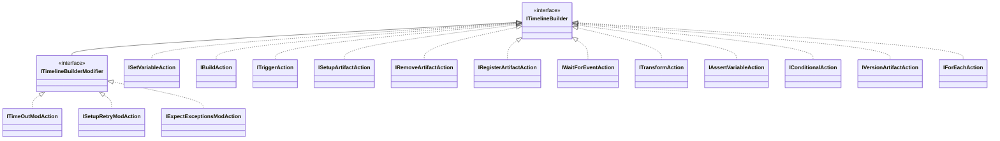
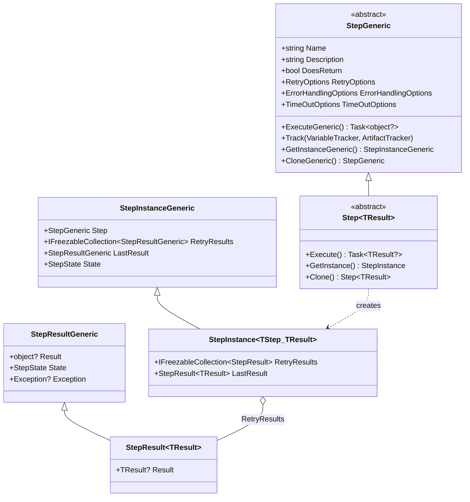
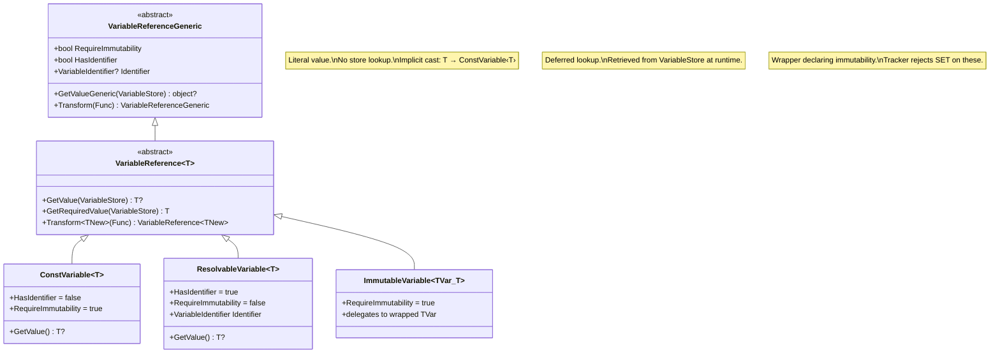
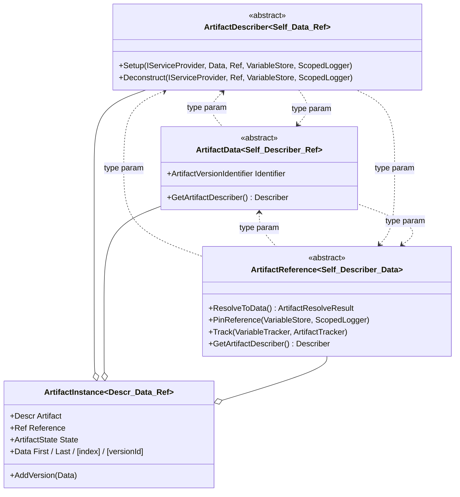
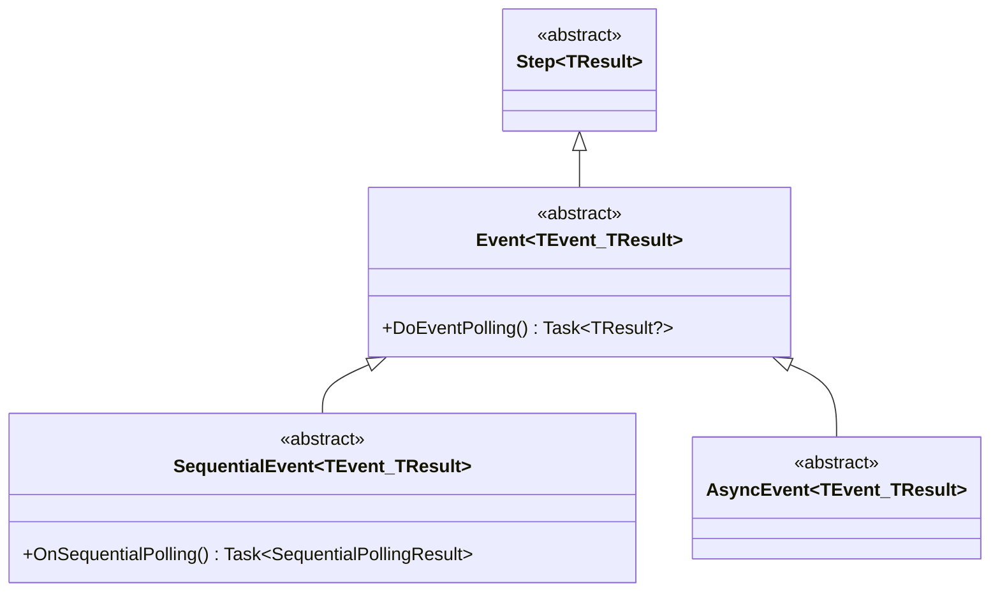

# Core Architecture & Type-Safe API

> **Scope**: This document covers `TestFrameworkCore` — the engine that provides the foundational scaffold.  
> Domain-specific logic (Azure, LocalIO, etc.) lives in separate extension projects.  
> For the high-level design rationale see [Documentation.md](Documentation.md).

---

## Table of Contents

1. [Design Philosophy](#1-design-philosophy)
2. [Freezable Pattern](#2-freezable-pattern)
3. [Timeline Model](#3-timeline-model)
4. [Run / Context Model](#4-run--context-model)
5. [Steps System](#5-steps-system)
6. [Variables System](#6-variables-system)
7. [Artifacts System](#7-artifacts-system)
8. [Events](#8-events)
9. [Extension Points](#9-extension-points)
10. [Minimal Example](#10-minimal-example)

---

## 1. Design Philosophy

The Core is an **engine** that only provides a scaffold — concrete behaviours are supplied by extensions.

**Key design principles:**

| Principle | Mechanism |
|-----------|-----------|
| **Compiler-validated types** | Generics with self-referencing constraints (CRTP) prevent type mismatches at compile time. |
| **Immutability after construction** | The [Freezable Pattern](#2-freezable-pattern) locks every object after it enters the execution pipeline. |
| **Separation of Build / Run / Result** | Three distinct phases each with their own types (Builder → Runner → Run). |
| **Extension-driven** | Core defines abstract base classes (`Step<TResult>`, `Event<TEvent, TResult>`, Artifact triple). Extensions implement them. |
| **Variable-referenced configuration** | Step options (`RetryOptions`, `TimeOutOptions`) use `VariableReference<T>` — config values can be resolved at runtime. |

### Lifecycle at a Glance

```mermaid
flowchart LR
    subgraph Build Phase
        A["Timeline.Create()"] --> B["ITimelineBuilder\n(fluent API)"]
        B --> C[".Build()"]
    end
    subgraph Run Phase
        C --> D["timeline.SetupRun()\n→ ITimelineRunBuilder"]
        D --> E[".AddVariable() / .AddArtifact()"]
        E --> F[".RunAsync()"]
    end
    subgraph Execution
        F --> G["Preprocess\n(Emit Steps)"]
        G --> H["Validate\n(Variable/Artifact Tracking)"]
        H --> I["Execute Main Stage"]
        I --> J["Execute Cleanup Stage"]
        J --> K["Freeze → TimelineRun"]
    end
```



---

## 2. Freezable Pattern

Every domain object implements `IFreezable`. Once `Freeze()` is called, mutations throw `InvalidOperationException`.

```csharp
public interface IFreezable
{
    bool IsFrozen { get; }
    void Freeze();
    void EnsureNotFrozen();  // throws if frozen
}
```

**Freezable collections** provide the same guarantee for data structures:

| Type | Description |
|------|-------------|
| `FreezableCollection<T>` | `ICollection<T>` — freezes itself and any `IFreezable` items recursively. |
| `FreezableDictionary<TKey, TValue>` | `IDictionary<TKey, TValue>` — freezes values recursively if they are `IFreezable`. |

**Why it matters:** After a Timeline is built, its structure is frozen. After a Run completes, every `StepResult`, `StageInstance`, `VariableStore`, and `ArtifactStore` is frozen — the result is an immutable snapshot of the entire execution.

---

## 3. Timeline Model

A **Timeline** is a collection of steps organized into two stages.

### 3.1 Timeline Class

```csharp
public class Timeline : IFreezable
{
    public static ITimelineBuilder Create();           // entry point

    public PreProcessableStage MainStage { get; }      // primary execution
    public PreProcessableStage CleanupStage { get; }   // artifact teardown

    public ITimelineRunBuilder SetupRun(
        IServiceProvider? serviceProvider = null,
        ITestOutputHelper? outputHelper = null);       // creates a run
}
```

- `MainStage` holds the steps that perform the test actions.
- `CleanupStage` holds the steps that deconstruct artifacts (auto-generated by the builder for every `SetupArtifact` / `RegisterArtifact` call).

### 3.2 PreProcessableStage

Stages store **emitters** (not concrete steps) during build time. Emitters expand into concrete steps when `RunAsync()` preprocesses the timeline.

```csharp
public class PreProcessableStage : IFreezable
{
    public string Name { get; set; }
    public string Description { get; set; }
    public IFreezableCollection<StepEmitter> Steps { get; }  // emitters
}
```

### 3.3 Builder: Fluent API

The builder is a composite of **12 action interfaces** + **3 modifier interfaces**:



**Action methods** return `ITimelineBuilderModifier` — so modifiers can be chained directly after:

```csharp
.Trigger(myStep)                            // → ITimelineBuilderModifier
    .WithRetry(3, i => TimeSpan.FromSeconds(i))  // modifier on Trigger
    .WithTimeOut(TimeSpan.FromMinutes(5))         // another modifier
.SetVariable<string>("key", "value")        // next action
```

**Control-flow actions** (`Conditional`, `ForEach`) return `ITimelineBuilder` (not `ITimelineBuilderModifier`), because they wrap nested sub-builders:

```csharp
.Conditional(Var.RefImmutable<bool>("flag"), thenBranch =>
{
    thenBranch.Trigger(someStep);
    thenBranch.SetVariable("x", 42);
})
.ForEach(Var.RefImmutable<string[]>("items"), "item", loop =>
{
    loop.Trigger(processStep);
})
```

#### Complete Action Reference

| Action | Signature | Purpose |
|--------|-----------|---------|
| `SetVariable<T>` | `(VariableIdentifier, VariableReference<T>)` | Set a runtime variable |
| `Trigger<TResult>` | `(Step<TResult>)` | Execute a custom step |
| `WaitForEvent<TEvent, TResult>` | `(Event<TEvent, TResult>)` | Wait for an external event |
| `Transform<TFrom, TTo>` | `(VarId, VarRef<TFrom>, Func<TFrom?, TTo>)` | Map one variable to another (sync or async) |
| `AssertVariable<T>` | `(VarRef<T>, Func<T?, bool>)` | Validate variable with predicate |
| `SetupArtifact` | `(ArtifactIdentifier)` | Setup artifact + auto-generate cleanup |
| `RemoveArtifact` | `(ArtifactIdentifier)` | Manually deconstruct an artifact |
| `RegisterArtifact` | `<TRef, TDescr, TData>(ArtifactId, TRef)` | Register externally-created artifact |
| `CaptureArtifactVersion` | `(ArtifactId, VersionId?)` | Snapshot current artifact state |
| `Conditional` | `(condition, Action<ITimelineBuilder>)` | Conditional step emission |
| `ForEach<TItem>` | `(collection, VarId, Action<ITimelineBuilder>)` | Loop emission |
| `Build` | `()` → `Timeline` | Finalize and freeze the timeline |

#### Modifier Reference

| Modifier | Signature | Default |
|----------|-----------|---------|
| `WithTimeOut` | `(VariableReference<TimeSpan>)` | 10 minutes |
| `WithRetry` | `(VarRef<int>, CalcDelay)` | 0 retries, exponential backoff |
| `ExpectExceptions` | `(params Type[])` | none |

---

## 4. Run / Context Model

### 4.1 ITimelineRunBuilder — Setting Up a Run

After building a `Timeline`, a run is configured via `ITimelineRunBuilder`:

```csharp
public interface ITimelineRunBuilder
{
    ITimelineRunBuilder AddVariable<T>(VariableIdentifier identifier, T value);
    ITimelineRunBuilder AddArtifact<TArtDescr, TArtData, TArtRef>(
        ArtifactIdentifier id,
        ArtifactReference<TArtRef, TArtDescr, TArtData> reference,
        ArtifactData<TArtData, TArtDescr, TArtRef> data);
    Task<TimelineRun> RunAsync();
}
```

Variables and artifacts registered here become the **external inputs** to the run and are tracked separately from those created during execution.

### 4.2 Execution Lifecycle (RunAsync)

```
RunAsync()
  │
  ├─ 1. PreProcessStages()
  │     ├─ Expand all StepEmitters → concrete Steps
  │     ├─ Apply modifier chains (timeout, retry, exceptions)
  │     └─ Track variable/artifact dependencies
  │
  ├─ 2. Validate
  │     ├─ VariableTracker.EnsureValidity()  → definition-order + immutability
  │     └─ ArtifactTracker.EnsureValidity()  → definition-order
  │
  ├─ 3. Execute Main Stage
  │     └─ CoreRunner.RunStage() → sequential step execution with retry
  │
  ├─ 4. Execute Cleanup Stage
  │     └─ CoreRunner.RunStage() → deconstruct artifacts
  │
  └─ 5. Freeze everything → return TimelineRun
```

### 4.3 TimelineRun — Immutable Result

```csharp
public class TimelineRun : IFreezable
{
    public Timeline Timeline { get; }
    public ArtifactStore ArtifactStore { get; }                   // all artifacts (versioned)
    public VariableStore VariableStore { get; }                   // all variable values
    public IFreezableCollection<StageInstance> Stages { get; }    // [MainStage, CleanupStage]

    public void EnsureRanToCompletion();  // throws if any stage is not Complete
}
```

### 4.4 StageInstance & StageResult

```csharp
public class StageInstance : IFreezable
{
    public Stage Stage { get; }
    public StageResult Result { get; }
    public IFreezableCollection<StepInstanceGeneric> Steps { get; }
}

public enum StageState { NotRun, Complete, Error }

public class StageResult : IFreezable
{
    public StageState State { get; set; }
}
```

---

## 5. Steps System

### 5.1 Type Hierarchy



### 5.2 StepGeneric — Abstract Base

Every step inherits from `StepGeneric` (non-generic base for interop) and `Step<TResult>` (typed subclass):

```csharp
public abstract class StepGeneric : IFreezable
{
    public abstract string Name { get; }
    public abstract string Description { get; }
    public abstract bool DoesReturn { get; }

    public RetryOptions RetryOptions { get; init; }
    public ErrorHandlingOptions ErrorHandlingOptions { get; init; }
    public TimeOutOptions TimeOutOptions { get; init; }

    public abstract Task<object?> ExecuteGeneric(
        IServiceProvider, VariableStore, ArtifactStore, ScopedLogger, CancellationToken);
    public abstract void Track(VariableTracker, ArtifactTracker);
    public abstract StepInstanceGeneric GetInstanceGeneric();
    public abstract StepGeneric CloneGeneric();
}

public abstract class Step<TResult> : StepGeneric
{
    public abstract Task<TResult?> Execute(
        IServiceProvider, VariableStore, ArtifactStore, ScopedLogger, CancellationToken);
    public abstract StepInstance<Step<TResult>, TResult> GetInstance();
    public abstract Step<TResult> Clone();
}
```

- **`DoesReturn`**: If `true`, the runner stores the result in a special `"out"` variable after execution.
- **`Clone()`**: Steps are cloned before execution to preserve the original template.
- **`Track()`**: Called during preprocessing to record variable/artifact dependencies.

### 5.3 Step Instance & Result

A `StepInstance` is the runtime representation of a step. It tracks every retry attempt:

```csharp
public enum StepState { NotRun, Complete, Timeout, Error, Skipped }

public class StepResultGeneric : IFreezable
{
    public object? Result { get; set; }
    public StepState State { get; set; }        // default: NotRun
    public Exception? Exception { get; set; }
}

public class StepResult<TResult> : StepResultGeneric
{
    public new TResult? Result { get; set; }    // typed access
}
```

Each retry adds a new `StepResult` to `RetryResults`. `LastResult` and `State` are computed from the most recent entry.

### 5.4 Step Options

| Option | Key Properties | Default |
|--------|----------------|---------|
| **RetryOptions** | `VariableReference<int> MaxRetryCount` | 0 |
|  | `VariableReference<CalcDelay> CalcDelay` | `i => TimeSpan.FromSeconds(Math.Pow(2, i))` |
| **TimeOutOptions** | `VariableReference<TimeSpan> TimeOut` | `TimeSpan.FromMinutes(10)` |
| **ErrorHandlingOptions** | `IFreezableCollection<Type> IgnoreExceptionTypes` | empty |

`CalcDelay` is a delegate: `delegate TimeSpan CalcDelay(int currentIteration);`

All option values are `VariableReference<T>` — they can be constants or resolvable from the variable store at runtime.

### 5.5 Step Preprocessor (Emitters)

The builder does not store concrete steps. It stores **StepEmitters** that generate steps during preprocessing:

```csharp
public record StepEmitterStepResult(StepGeneric Step, bool RedirectToCleanUp = false);

public abstract class StepEmitter
{
    public abstract IEnumerable<StepEmitterStepResult> Emit(
        ArtifactStore, VariableStore, VariableTracker, ArtifactTracker,
        List<Action<StepGeneric, VariableTracker, ArtifactTracker>> modifierActions);

    public void AddModifier(Action<StepGeneric, VariableTracker, ArtifactTracker> action);
}
```

| Emitter | Behaviour |
|---------|-----------|
| `SingleStepEmitter` | Wraps one step. Clones it, applies modifiers, yields one result. |
| `ConditionalStepEmitter` | Evaluates a `VariableReference<bool>` at preprocess time. Yields nested builder steps if `true`, nothing if `false`. |
| `ForEachStepEmitter<TItem>` | Iterates a collection at preprocess time. For each item, emits a `SetVariableStep` + the nested builder body. |

**Modifier chain**: `.WithTimeOut()`, `.WithRetry()`, `.ExpectExceptions()` are stored as modifier callbacks on the last emitter. They are applied when the emitter executes `Emit()`.

### 5.6 System Steps (Built-In)

These are `internal` step implementations used by the builder:

| Step | Generic Params | Purpose |
|------|---------------|---------|
| `SetVariableStep` | — | Sets a variable in the store from a `VariableReferenceGeneric` |
| `TransformStep<TFrom, TTo>` | `TFrom`, `TTo` | Applies an async transformation from one variable to another |
| `SetupArtifactStep` | — | Pins an artifact reference, calls `SetupGeneric()`, marks state as `Setup` |
| `DeconstructArtifactStep` | — | Calls `DeconstructGeneric()`, marks state as `Cleaned` (only if currently `Setup`) |
| `RegisterArtifactStep<TDescr, TData, TRef>` | 3 artifact types | Resolves an external artifact, creates an `ArtifactInstance`, adds to store |
| `CaptureArtifactVersionStep` | — | Resolves artifact to a specific version and adds it to the version history |
| `AssertVariableStep<T>` | `T` | Evaluates a predicate against a variable value, throws `AssertVariableException` if false |

### 5.7 Execution Engine (CoreRunner)

The `CoreRunner` executes a single stage:

```
For each StepInstance in stage:
  │
  ├─ Retry loop (iteration = 1..MaxRetryCount+1)
  │   ├─ If iteration > 1: await CalcDelay(iteration)
  │   ├─ Create CancellationTokenSource(TimeOut)
  │   ├─ Execute step
  │   ├─ On success:
  │   │   ├─ State = Complete
  │   │   └─ If DoesReturn: VariableStore["out"] = result
  │   └─ On exception:
  │       ├─ If type in IgnoreExceptionTypes → State = Complete
  │       └─ Otherwise → State = Error
  │   └─ Freeze StepResult, add to RetryResults
  │
  ├─ If last State != Complete → Stage.Result.State = Error, return
  └─ Freeze StepInstance
```

The stage processes steps **sequentially** — each step completes (including all retries) before the next begins. If any step ultimately fails, the stage is marked `Error` and execution stops.

---

## 6. Variables System

### 6.1 Type Hierarchy



### 6.2 Var Factory

The `Var` static class is the user-facing API for creating variable references:

```csharp
public static class Var
{
    // Constant value — no store lookup needed
    public static ConstVariable<T> Const<T>(T value);

    // Resolvable reference — looked up from VariableStore by identifier
    public static ResolvableVariable<T> Ref<T>(VariableIdentifier identifier);

    // Immutable resolvable reference — tracker rejects any SET on this identifier
    public static ImmutableVariable<ResolvableVariable<T>, T>
        RefImmutable<T>(VariableIdentifier identifier);
}
```

**Implicit conversions** make the API ergonomic:

```csharp
// string → VariableIdentifier (implicit)
VariableIdentifier id = "myVar";

// T → VariableReference<T> (implicit, wraps in ConstVariable<T>)
VariableReference<int> five = 5;
```

### 6.3 Transform Chains

Variable references support composable transformations:

```csharp
// Single transform — appends to chain, returns new reference
Var.Ref<int>("count")
    .Transform(x => x * 2)          // → ResolvableVariable<int>
    .Transform(x => x.ToString());   // → ResolvableVariable<string>

// Multi-variable transform — depends on other variables
Var.Ref<string>("greeting")
    .Transform((greeting, vars) =>
        greeting + " " + vars[0],    // vars[0] = resolved "name"
        Var.Ref<string>("name"));    // → ResolvableVariable<string>
```

**Const vs Resolvable transform behaviour:**

| | `ConstVariable<T>` | `ResolvableVariable<T>` |
|-|---------------------|-------------------------|
| Single-value `.Transform()` | **Eager** — evaluates immediately, returns new `ConstVariable` | **Lazy** — appends to chain, evaluates on `GetValue()` |
| Multi-variable `.Transform()` | **Lazy** — stores transform + deps | **Lazy** — stores transform + deps |

### 6.4 VariableStore

Runtime storage for variable values:

```csharp
public class VariableStore : IFreezable
{
    public void SetVariable<T>(VariableIdentifier identifier, T value);
    public T? GetVariable<T>(VariableIdentifier identifier);
    public object? GetVariable(VariableIdentifier identifier);
}
```

The store holds values as `object?`. Transforms are not applied by the store — they are applied by the `VariableReference` implementations during `GetValue()`.

### 6.5 VariableTracker — Compile-Time-Like Validation

During preprocessing, every step's `Track()` method logs its variable dependencies to a `VariableTracker`. After preprocessing, `EnsureValidity()` validates:

1. **Definition order**: Every `GET` must reference a variable that was `SET` earlier (or is an external variable).
2. **Immutability**: No `SET` may target a variable that was accessed through an `ImmutableVariable`.

Validation errors:

| Exception | Cause |
|-----------|-------|
| `VariableDoesNotExistException` | GET references an identifier that is never SET |
| `VariableDoesNotYetExistException` | GET references an identifier that is SET later (order violation) |
| `CannotSetImmutableVariableException` | SET targets an identifier that was read via ImmutableVariable |

---

## 7. Artifacts System

### 7.1 Three-Tier Generic System (CRTP)

Artifacts use a self-referencing generic pattern (Curiously Recurring Template Pattern) to ensure complete type safety across the triple:



The constraint pattern ensures that when you implement one part, the compiler enforces consistency with the other two:

```csharp
// All three type parameters cross-reference each other:
public abstract class ArtifactDescriber<TArtifactDescriber, TArtifactData, TArtifactReference>
    where TArtifactDescriber : ArtifactDescriber<TArtifactDescriber, TArtifactData, TArtifactReference>, new()
    where TArtifactData     : ArtifactData<TArtifactData, TArtifactDescriber, TArtifactReference>
    where TArtifactReference: ArtifactReference<TArtifactReference, TArtifactDescriber, TArtifactData>
{
    public abstract Task Setup(IServiceProvider, TArtifactData, TArtifactReference, VariableStore, ScopedLogger);
    public abstract Task Deconstruct(IServiceProvider, TArtifactReference, VariableStore, ScopedLogger);
}
```

### 7.2 The Three Components

| Component | Responsibility | Key Methods |
|-----------|---------------|-------------|
| **ArtifactDescriber** | Defines *how* to set up and tear down an artifact kind. Stateless. | `Setup(...)`, `Deconstruct(...)` |
| **ArtifactData** | Carries the artifact's payload in a raw, serializable form (e.g. bytes for a blob, rows for a DB). Supports versioning via `ArtifactVersionIdentifier`. | `GetArtifactDescriber()` |
| **ArtifactReference** | Identifies *which specific* artifact this is. Resolves to data from the external source. Pinnable (freezes variable-derived values). | `ResolveToData(...)`, `PinReference(...)`, `Track(...)` |

### 7.3 ArtifactInstance — Runtime Tracking

```csharp
public enum ArtifactState { NotSetup, Setup, Cleaned, NotFound }

public class ArtifactInstance<TArtifactDescriber, TArtifactData, TArtifactReference>
    : ArtifactInstanceGeneric
{
    public TArtifactDescriber Artifact { get; }
    public TArtifactReference Reference { get; }
    public ArtifactState State { get; set; }

    // Version access (multiple snapshots during a run)
    public TArtifactData First { get; }
    public TArtifactData Last { get; }
    public TArtifactData this[int index] { get; }
    public TArtifactData this[ArtifactVersionIdentifier id] { get; }
    public int VersionCount { get; }

    public void AddVersion(TArtifactData data);
}
```

### 7.4 Artifact Lifecycle

```
  NotSetup
     │
     ├─ SetupArtifactStep ──► Setup
     │                          │
     │                          ├─ CaptureArtifactVersionStep (can repeat)
     │                          │
     │                          └─ DeconstructArtifactStep ──► Cleaned
     │
     └─ RegisterArtifactStep ──► Setup  (if found)
                               ──► NotFound  (if not found)
```

- **Setup** is called with the `ArtifactData` and `ArtifactReference`.
- **Deconstruct** only runs if state is `Setup` — safe to call unconditionally.
- **CaptureArtifactVersion** can be called multiple times to track state evolution.
- **Register** resolves an externally-created artifact into the store.

### 7.5 ArtifactStore & ArtifactTracker

```csharp
public class ArtifactStore : IFreezable
{
    public void AddArtifact(ArtifactInstanceGeneric instance);
    public ArtifactInstanceGeneric GetArtifact(ArtifactIdentifier id);
    public ArtifactInstance<TDescr, TData, TRef> GetArtifact<TDescr, TData, TRef>(ArtifactIdentifier id);
    public IEnumerable<ArtifactInstanceGeneric> GetAll();
}
```

`ArtifactTracker` mirrors `VariableTracker`: it logs SET/GET operations and `EnsureValidity()` checks definition order.

### 7.6 Identifiers

```csharp
public record ArtifactIdentifier(string Identifier);       // implicit ↔ string
public record ArtifactVersionIdentifier(string Identifier); // implicit ↔ string; Default = ""
```

---

## 8. Events

Events are **steps that poll** for external state changes. They inherit from `Step<TResult>`.



### 8.1 Event Base

```csharp
public abstract class Event<TEvent, TResult> : Step<TResult>
    where TEvent : Event<TEvent, TResult>  // self-constraining
{
    public abstract Task<TResult?> DoEventPolling(
        IServiceProvider, VariableStore, ArtifactStore, ScopedLogger, CancellationToken);

    // Execute delegates to DoEventPolling
    public override Task<TResult?> Execute(...) => DoEventPolling(...);
}
```

The self-constraining generic (`TEvent : Event<TEvent, TResult>`) ensures type-safe hierarchies.

### 8.2 SequentialEvent — Polling Pattern

```csharp
public record SequentialPollingResult<TResult>(bool IsDone, TResult? Result, TimeSpan NextDelay);

public abstract class SequentialEvent<TEvent, TResult> : Event<TEvent, TResult>
    where TEvent : SequentialEvent<TEvent, TResult>
{
    public abstract Task<SequentialPollingResult<TResult>> OnSequentialPolling(
        IServiceProvider, VariableStore, ArtifactStore, ScopedLogger, CancellationToken);
}
```

The polling loop runs until `IsDone == true`, sleeping `NextDelay` between iterations. The step's `TimeOutOptions` cancellation token enforces the overall timeout.

### 8.3 AsyncEvent

Marker base class for events that complete asynchronously (e.g., via callbacks). Extensions implement the specific mechanism.

---

## 9. Extension Points

The Core defines abstract types that extensions implement. Here is how to extend each concept:

### 9.1 Custom Step

```csharp
public class MyStep : Step<MyResult>
{
    public override string Name => "My Custom Step";
    public override string Description => "Does something useful";
    public override bool DoesReturn => true;

    public override async Task<MyResult?> Execute(
        IServiceProvider serviceProvider,
        VariableStore variableStore,
        ArtifactStore artifactStore,
        ScopedLogger logger,
        CancellationToken cancellationToken)
    {
        logger.LogInformation("Executing my step...");
        // your logic here
        return new MyResult(/* ... */);
    }

    public override void Track(VariableTracker variableTracker, ArtifactTracker artifactTracker)
    {
        // Declare dependencies: e.g. variableTracker.GetReference(someVarRef);
    }

    public override StepInstance<Step<MyResult>, MyResult> GetInstance()
        => new StepInstance<Step<MyResult>, MyResult>(this);

    public override Step<MyResult> Clone()
        => new MyStep().WithClonedOptions(this);
}
```

### 9.2 Custom Artifact Triple

Implement all three types with matching generic constraints:

```csharp
// 1. Describer — how to create/destroy
public class BlobDescriber
    : ArtifactDescriber<BlobDescriber, BlobData, BlobReference>
{
    public override async Task Setup(
        IServiceProvider sp, BlobData data, BlobReference reference,
        VariableStore vars, ScopedLogger logger)
    {
        // Upload data.Bytes to reference.ContainerUrl / reference.BlobName
    }

    public override async Task Deconstruct(
        IServiceProvider sp, BlobReference reference,
        VariableStore vars, ScopedLogger logger)
    {
        // Delete blob at reference.ContainerUrl / reference.BlobName
    }
}

// 2. Data — raw payload
public class BlobData
    : ArtifactData<BlobData, BlobDescriber, BlobReference>
{
    public byte[] Bytes { get; init; }
}

// 3. Reference — external identity + resolution
public class BlobReference
    : ArtifactReference<BlobReference, BlobDescriber, BlobData>
{
    public VariableReference<string> ContainerUrl { get; init; }
    public VariableReference<string> BlobName { get; init; }

    public override async Task<ArtifactResolveResult<BlobDescriber, BlobData, BlobReference>>
        ResolveToData(IServiceProvider sp, ArtifactVersionIdentifier versionId,
                      VariableStore vars, ScopedLogger logger)
    {
        // Download blob → return new ArtifactResolveResult<...> { Found = true, Data = new BlobData { Bytes = ... } }
    }

    public override void PinReference(VariableStore vars, ScopedLogger logger)
    {
        // Resolve variable-referenced fields to concrete values
    }

    public override void Track(VariableTracker variableTracker, ArtifactTracker artifactTracker)
    {
        variableTracker.GetReference(ContainerUrl);
        variableTracker.GetReference(BlobName);
    }
}
```

### 9.3 Custom Event

```csharp
public class QueueMessageEvent
    : SequentialEvent<QueueMessageEvent, string>
{
    public override string Name => "Wait for Queue Message";
    public override string Description => "Polls a queue until a message arrives";
    public override bool DoesReturn => true;

    public override async Task<SequentialPollingResult<string>> OnSequentialPolling(
        IServiceProvider sp, VariableStore vars, ArtifactStore artifacts,
        ScopedLogger logger, CancellationToken ct)
    {
        var message = await PollQueue(sp);
        if (message != null)
            return new(IsDone: true, Result: message, NextDelay: TimeSpan.Zero);
        return new(IsDone: false, Result: null, NextDelay: TimeSpan.FromSeconds(2));
    }

    // ... Clone(), GetInstance(), Track() ...
}
```

### 9.4 Dependency Injection via IServiceProvider

Steps, Events, and Artifact methods all receive an `IServiceProvider`. Extensions can register services during run setup:

```csharp
var run = await timeline
    .SetupRun(serviceProvider: myServiceCollection.BuildServiceProvider())
    .AddVariable("key", "value")
    .RunAsync();
```

If no `IServiceProvider` is supplied, an `EmptyServiceProvider` (returns `null` for all requests) is used.

---

## 10. Minimal Example

A complete example demonstrating the core concepts:

```csharp
// ── 1. Define a custom step ──────────────────────────────────
public class GreetStep : Step<string>
{
    private readonly VariableReference<string> _name;

    public GreetStep(VariableReference<string> name) => _name = name;

    public override string Name => "Greet";
    public override string Description => "Generates a greeting";
    public override bool DoesReturn => true;

    public override Task<string?> Execute(
        IServiceProvider sp, VariableStore vars, ArtifactStore artifacts,
        ScopedLogger logger, CancellationToken ct)
    {
        var name = _name.GetValue(vars);
        var greeting = $"Hello, {name}!";
        logger.LogInformation(greeting);
        return Task.FromResult<string?>(greeting);
    }

    public override void Track(VariableTracker vt, ArtifactTracker at)
        => vt.GetReference(_name);

    public override StepInstance<Step<string>, string> GetInstance()
        => new(this);

    public override Step<string> Clone()
        => new GreetStep(_name).WithClonedOptions(this);
}

// ── 2. Build a Timeline ──────────────────────────────────────
Timeline timeline = Timeline.Create()

    // Trigger the custom step — result stored in "out"
    .Trigger(new GreetStep(Var.Ref<string>("userName")))
        .WithTimeOut(TimeSpan.FromSeconds(30))

    // Transform the "out" variable
    .Transform<string, string>("shout", Var.Ref<string>("out"),
        greeting => greeting.ToUpperInvariant())

    // Assert the result
    .AssertVariable(Var.Ref<string>("shout"),
        s => s != null && s.StartsWith("HELLO"))

    // Conditional logic
    .Conditional(Var.RefImmutable<bool>("verbose"), thenBranch =>
    {
        thenBranch.Trigger(new GreetStep(Var.Ref<string>("userName").Transform(n => n + " (verbose)")));
    })

    // ForEach loop
    .ForEach(Var.RefImmutable<string[]>("extraNames"), "item", loop =>
    {
        loop.Trigger(new GreetStep(Var.Ref<string>("item")));
    })

    .Build();

// ── 3. Run the Timeline ──────────────────────────────────────
TimelineRun run = await timeline
    .SetupRun(outputHelper: output)         // xUnit ITestOutputHelper
    .AddVariable("userName", "Alice")
    .AddVariable("verbose", true)
    .AddVariable("extraNames", new[] { "Bob", "Charlie" })
    .RunAsync();

// ── 4. Verify ────────────────────────────────────────────────
run.EnsureRanToCompletion();

// Access variables from the run
string? shout = run.VariableStore.GetVariable<string>("shout");
// shout == "HELLO, ALICE!"
```

**What this demonstrates:**

| Concept | Where |
|---------|-------|
| Custom `Step<TResult>` | `GreetStep` with typed result |
| `Var.Ref<T>()` / `Var.RefImmutable<T>()` | Variable references throughout |
| Transform chains | `.Transform(n => n + " (verbose)")` |
| Builder fluent API | `.Trigger().WithTimeOut().Transform().AssertVariable()...` |
| Modifier chaining | `.WithTimeOut()` after `.Trigger()` |
| Conditional emission | `.Conditional(flag, inner => ...)` |
| ForEach emission | `.ForEach(collection, "iterVar", inner => ...)` |
| Run setup with variables | `.AddVariable("userName", "Alice")` |
| Result access | `run.VariableStore.GetVariable<string>("shout")` |
| Completion assertion | `run.EnsureRanToCompletion()` |
